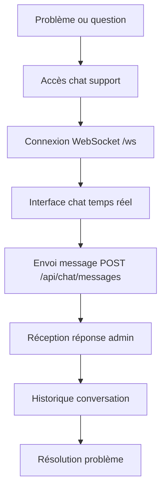
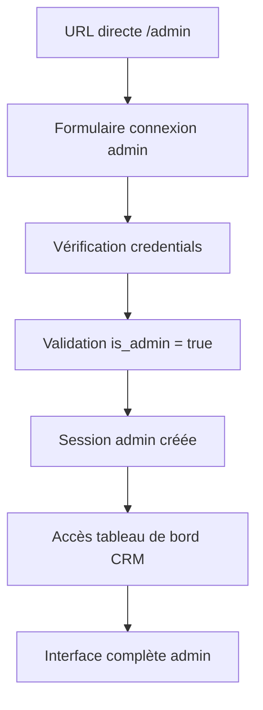
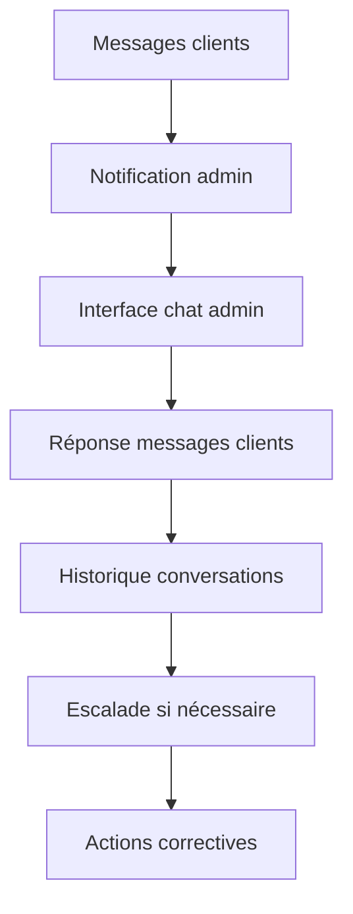
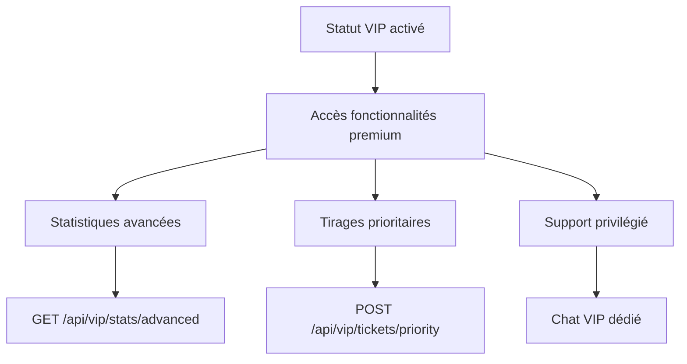
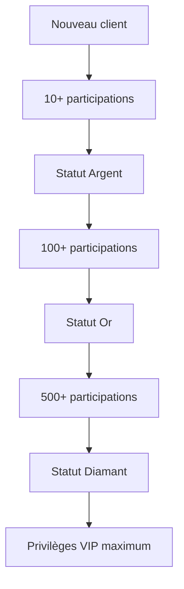

# WORKFLOWS UTILISATEUR COMPLETS - BRACHAVEHATZLACHA

## 🔄 WORKFLOW CLIENT STANDARD

### 1. INSCRIPTION ET PREMIÈRE CONNEXION
```mermaid
graph TD
    A[Accès site web] --> B[Clic "Connexion Client"]
    B --> C[Formulaire inscription]
    C --> D[Saisie: email, mot de passe, prénom, nom, téléphone, langue]
    D --> E[Validation côté client]
    E --> F[Envoi serveur POST /api/register]
    F --> G[Création compte + bonus 100₪]
    G --> H[Session créée]
    H --> I[Redirection page d'accueil utilisateur]
    I --> J[Affichage solde et fonctionnalités]
```

### 2. ACHAT DE TICKET
```mermaid
graph TD
    A[Page d'accueil client] --> B[Section "Participer au Loto"]
    B --> C[Grille 37 numéros]
    C --> D[Sélection 6 numéros]
    D --> E[Saisie montant ≥ 100₪]
    E --> F[Vérification solde suffisant]
    F --> G[Validation formulaire]
    G --> H[POST /api/tickets]
    H --> I[Déduction solde utilisateur]
    I --> J[Création ticket dans BDD]
    J --> K[Affichage confirmation]
    K --> L[Mise à jour historique]
```

### 3. SUIVI DES PARTICIPATIONS
```mermaid
graph TD
    A[Espace personnel] --> B[Section "Mes Tickets"]
    B --> C[GET /api/tickets/user]
    C --> D[Affichage liste tickets]
    D --> E[Détails: numéros, montant, tirage]
    E --> F[Statut: en attente/complété]
    F --> G[Résultats si disponibles]
    G --> H[Gains éventuels]
```

### 4. GESTION FINANCIÈRE
```mermaid
graph TD
    A[Espace personnel] --> B[Section "Solde et Transactions"]
    B --> C[GET /api/transactions/user]
    C --> D[Affichage historique complet]
    D --> E[Types: achats, gains, bonus, dépôts]
    E --> F[Solde actuel temps réel]
    F --> G[Code parrainage personnel]
    G --> H[Lien parrainage avec QR code]
```

### 5. SUPPORT CLIENT


---

## 👑 WORKFLOW ADMINISTRATEUR

### 1. ACCÈS ET AUTHENTIFICATION ADMIN


### 2. GESTION UTILISATEURS
```mermaid
graph TD
    A[Dashboard admin] --> B[Section "Gestion Utilisateurs"]
    B --> C[GET /api/admin/users]
    C --> D[Liste complète utilisateurs]
    D --> E[Actions disponibles]
    E --> F[Créer nouvel utilisateur]
    E --> G[Effectuer dépôt manuel]
    E --> H[Bloquer/débloquer compte]
    F --> I[POST /api/admin/create-user]
    G --> J[POST /api/admin/deposit]
    H --> K[PUT /api/admin/users/:id/block]
```

### 3. GESTION DES TIRAGES
```mermaid
graph TD
    A[Dashboard admin] --> B[Section "Gestion Tirages"]
    B --> C[Tirages actifs et historique]
    C --> D[Créer nouveau tirage]
    C --> E[Saisir résultats tirage]
    D --> F[POST /api/admin/draws]
    E --> G[PUT /api/admin/draws/:id/results]
    G --> H[Calcul automatique gains]
    H --> I[Notification gagnants]
    I --> J[Mise à jour soldes]
```

### 4. MONITORING ET STATISTIQUES
```mermaid
graph TD
    A[Dashboard admin] --> B[Section "Statistiques"]
    B --> C[GET /api/admin/stats/complete]
    C --> D[Métriques temps réel]
    D --> E[Revenus totaux]
    D --> F[Utilisateurs actifs]
    D --> G[Participations tirages]
    D --> H[Gains distribués]
    E --> I[Graphiques revenus]
    F --> J[Répartition langues]
    G --> K[Taux participation]
    H --> L[Ratio gains/revenus]
```

### 5. MODÉRATION CHAT


---

## 🌟 WORKFLOW VIP CLIENT

### 1. AVANTAGES VIP


### 2. PROGRESSION STATUT


---

## 📱 MENUS ET INTERFACES PAR RÔLE

### CLIENT STANDARD - MENU PRINCIPAL
```
🏠 Accueil
├── Tirage actuel
├── Participer au loto
├── Grille numéros (1-37)
└── Montant participation

👤 Espace Personnel
├── Mes tickets
├── Historique participations
├── Transactions
├── Solde actuel
├── Code parrainage
└── Paramètres langue

💬 Support
├── Chat en direct
├── Historique conversations
└── FAQ

🚪 Déconnexion
```

### CLIENT VIP - MENU ÉTENDU
```
🏠 Accueil (identique client standard)

👑 Espace VIP
├── Statistiques avancées
├── Tirages prioritaires
├── Historique détaillé
├── Prévisions gains
└── Support prioritaire

👤 Espace Personnel (identique + VIP features)

💬 Support VIP
├── Chat prioritaire
├── Ligne directe admin
└── Support téléphonique

🚪 Déconnexion
```

### ADMINISTRATEUR - MENU CRM COMPLET
```
📊 Dashboard
├── Statistiques générales
├── Revenus temps réel
├── Utilisateurs connectés
└── Alertes système

👥 Gestion Utilisateurs
├── Liste complète utilisateurs
├── Créer nouvel utilisateur
├── Effectuer dépôts manuels
├── Bloquer/débloquer comptes
├── Gérer statuts VIP
└── Historique actions

🎯 Gestion Tirages
├── Tirages actifs
├── Créer nouveau tirage
├── Saisir résultats
├── Historique tirages
├── Statistiques tirages
└── Gestion jackpot

💰 Gestion Financière
├── Transactions globales
├── Réconciliation comptes
├── Rapports financiers
├── Audit soldes
└── Export données

💬 Modération
├── Messages chat
├── Conversations actives
├── Historique support
└── Gestion conflits

⚙️ Administration
├── Configuration système
├── Paramètres langues
├── Gestion permissions
├── Logs système
├── Sauvegarde BDD
└── Maintenance

🚪 Déconnexion Admin
```

---

## 🔒 RÈGLES D'ACCÈS DÉTAILLÉES

### PERMISSIONS PAR ENDPOINT

#### Routes Publiques (Aucune auth requise)
- `GET /api/draws/current` - Consulter tirage actuel
- `POST /api/login` - Connexion utilisateur
- `POST /api/register` - Inscription utilisateur

#### Routes Client Authentifié
- `GET /api/auth/user` - Profil utilisateur
- `POST /api/tickets` - Achat ticket (vérif solde)
- `GET /api/tickets/user` - Mes tickets
- `GET /api/transactions/user` - Mes transactions
- `POST /api/chat/messages` - Envoyer message chat
- `GET /api/chat/messages` - Historique chat

#### Routes VIP (Auth + Statut VIP)
- `GET /api/vip/stats/advanced` - Stats avancées
- `POST /api/vip/tickets/priority` - Tickets prioritaires
- `GET /api/vip/draws/preview` - Aperçu tirages

#### Routes Admin (Auth + is_admin = true)
- `POST /api/admin/create-user` - Créer utilisateur
- `GET /api/admin/users` - Liste utilisateurs
- `POST /api/admin/deposit` - Dépôt manuel
- `POST /api/admin/draws` - Créer tirage
- `PUT /api/admin/draws/:id/results` - Saisir résultats
- `GET /api/admin/stats/complete` - Stats complètes
- `PUT /api/admin/users/:id/block` - Bloquer utilisateur
- `PUT /api/admin/users/:id/unblock` - Débloquer utilisateur

### VALIDATION CÔTÉ CLIENT
```typescript
// Vérification rôle utilisateur (client/src/hooks/useAuth.ts)
const { user, isAuthenticated } = useAuth();
const isAdmin = user?.isAdmin;
const isVIP = user?.status === 'vip' || user?.isAdmin;
```

### PROTECTION ROUTES FRONTEND
```typescript
// Protection routes admin (client/src/App.tsx)
{(user as any)?.isAdmin ? (
  <>
    <Route path="/admin" component={Admin} />
    <Route path="/admin/*" component={Admin} />
  </>
) : (
  <Route path="/admin" component={AdminLogin} />
)}
```